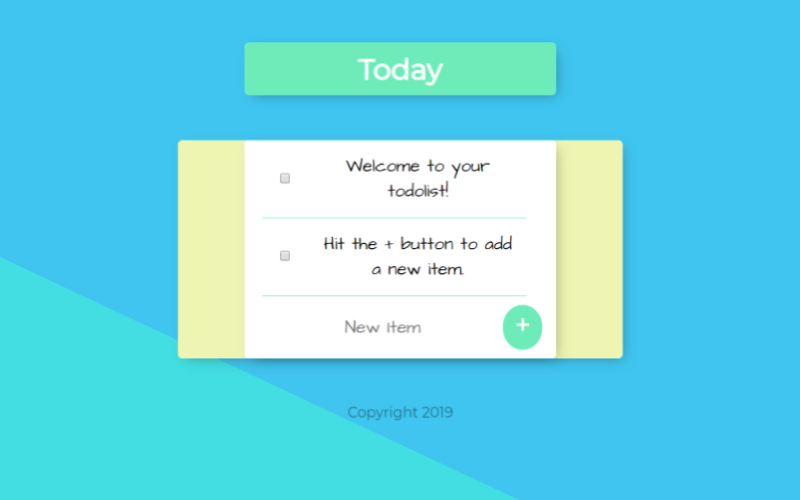

# The To-Do List
> Tip calculator tool.

To-do list with beautiful and easy to use UI, the user can add a to-do by typing a task in the input and clicking the "+" button, after that they can rather check the to-do when it's done and remove it using the checkbox button. Any list can be created by using the url with a forward slash of the name you wish to title the new list.




## Features

* [X] Creat infinite lists with custom titles and can modify items as needed.
* [X] Options to add and remove tasks as necessary 
* [X] Stores user data


## Installation and Dependencies

- Install the latest version of <a href="https://nodejs.org/en/">Node.js</a>
- Install <a href="https://docs.npmjs.com/downloading-and-installing-node-js-and-npm">NPM Dependencies</a> 
  - Download NPM package manager on the command line:
  
  ```sh
  npm install npm -g
  ```
  
  - Create a package JSON file:

  ```sh
  npm init
  ```
  
  - Install mongodb and create a database directory:
  
  ```sh
  npm install mongodb
  mongod --dbpath=/to-do-list
  ```
  
  - Install Express and body parser modules:
  
   ```sh
  npm i express body-parser 
  ```
    > Why is this important?
    > Express.js will be used for routing and body parser will allow you to parse your html doc and return the necessary input data.


- Integrate <a href="https://getbootstrap.com/">Bootstrap</a> for CSS framework
  - You can either install through the command line or simply copy/paste the readily available <a href="https://getbootstrap.com/docs/4.4/getting-started/introduction/">Boostrap CDN</a> into your HTML <head></head> (preferred for faster bandwith and decreased load time)
  
  
## Development

To develop the application you will need to first require the modules and construct an Express application inside your source code (i.e. app.js) -- 

This app relies heavily on Express and body parser for development. Here is a basic template of the server set up:

```javascript
// require modules and create Express application
var express = require('express');
var bodyParser = require('body-parser');
var app = express();

app.use(bodyParser.urlEncoded({extended:true}));

// application code goes here


// create a connection to your local server
app.listen(3000);
```

Check out the Express.js <a href="https://expressjs.com/en/guide/routing.html">routing references</a> for more info.

-Run a mongod process (in a seperate terminal) and leave running while in development:

 ```sh
  mongod
  ```
  
  
Connect to <a href="http://mongodb.github.io/node-mongodb-native/3.4/quick-start/quick-start/">mongoDB</a> by writing the following server code just under the previously required modules:


```javascript
const MongoClient = require('mongodb').MongoClient;
const assert = require('assert');

// Connection URL
const url = 'mongodb://localhost:27017';

// Database Name
const dbName = 'myproject';

// Create a new MongoClient
const client = new MongoClient(url);

// Use connect method to connect to the Server
client.connect(function(err) {
  assert.equal(null, err);
  console.log("Connected successfully to server");

  const db = client.db(dbName);

  client.close();
});
```


Be sure to run your app.js file using the terminal, I used Nodemon for development. 

Nodemon makes this process a lot easier by automatically restarting the node application when file changes in the directory are detected.

It would look like this:

```sh
nodemon app.js
```


From there you can launch locally on your server from http://locallhost.com/3000. 


## Technologies Used

* mongoDB
* Express.js
* Bootstrap


## Contributing

Contributions are always welcome!
Please read the [contribution guidelines](contributing.md) first.

1. Fork it (<https://github.com/ericawills/to-do-app/fork>)
2. Create your feature branch (`git checkout -b feature/fooBar`)
3. Commit your changes (`git commit -m 'Add some fooBar'`)
4. Push to the branch (`git push origin feature/fooBar`)
5. Create a new Pull Request


<h2 style="font-weight: bold;">License</h2>
<p>This project is licensed under the MIT License - see the LICENSE.md file for details</p>


